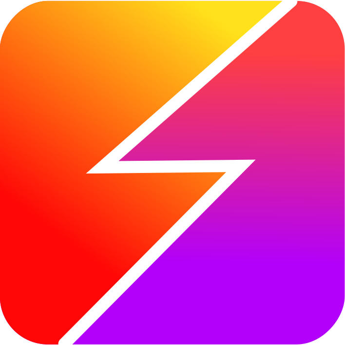

# stutter   

 

**stutter** _(noun)_

1. Distorted speech characterized principally by blocks or spasms interrupting the rhythm.

2. A [Rapid Serial Visual Presentation](https://en.wikipedia.org/wiki/Rapid_serial_visual_presentation) (RSVP) extension for modern web browsers. It is based upon my initial work in a Google Chrome extension, [read](https://github.com/jamestomasino/read_plugin). This is an attempt to modernize the code and offer cross-browser support.

## Source Install and Testing

**stutter** is built using webpack and babel, with sass support and eslint styling. The code is written using es6 classes. Backend and content-scripts are maintained separately with individual webpack configurations.

To install all dependencies:

    $ yarn

To build the project:

    $ yarn build

To lint the source:

    $ yarn test

To lint the extension configuration (_must build first_):

    $ yarn webext-test

To locally test the extension in Firefox:

    $ yarn extension

To package the extension for production:

    $ yarn package

## TODO

- [x] Verify ES6 support for web extensions (with babel)
- [x] Client-side full-page parsing for readable content (like old Readability API)
- [x] Create selection context-menu as trigger
- [x] Pass selection data to RSVP processor
- [x] Create data structures for calculation of display sequence
- [x] Create on-screen display for RSVP
- [x] Options for speed personalization
- [x] Saving of personalization settings
- [x] Progress display
- [x] Chrome plugin support
- [x] Light theme with toggle in settings
- [x] Syncing of personalization settings through browser sync
- [ ] Mobile support in Firefox Android
- [ ] Seek-bar / rewind

## Permissions

This extension uses several permissions allowed by the web extensions API.

### contextMenus

Stutter allows you to read selected text by highlighting content and right-clicking to view the context menu option. This permission allows us to add the Stutter option to the context menu.

### activeTab

This permission allows the extension to inject the content script code into the browser tab when an action takes place, like clicking on the extension icon. It provides a limited access to the tab that's active when triggered.

### storage

Options in the settings page are stored in browser storage by using this permission. These settings persist between browser restarts.

In a future release of stutter, these settings will sync between browsers if you have browser sync enabled.

## 3rd Party Runtime Libraries

Full page content is analyzed and isolated by means of the [Mozilla Readability Library](https://github.com/mozilla/readability). The version in this project is modified for linting and exported as an es6 module. No changes have been made to the library logic.

[babel-polyfill](https://babeljs.io/docs/en/babel-polyfill) is used during runtime to emulate a full ES2015+ where a browser may be insufficient.

## Contributing

### General Guidelines

Pull requests are welcome. For major changes, please open an issue first to
discuss what you would like to change.

### Themes

The easiest addition to stutter is the creation of new themes. Adding a new theme requires only three additions to the code-base:

1. Add a new scss file in `src-content/themes/` that begins with an underscore and is named for your theme, such as `src-content/themes/_skeletor.scss`. Copy the `_default.scss` file as a starting point and change the colors to your heart's desire.

2. Add a your theme to the themes list by appending `@import "yourtheme"` to `src-content/themes/_themes.scss`.

3. Add your theme's name to the select box in the options page located at `src-options/index.html`

That's it! Pick a descriptive name and send a pull request!

## License

[GPL3](LICENSE)

Mozilla's Readability library - http://www.apache.org/licenses/LICENSE-2.0
